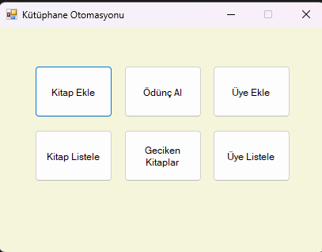
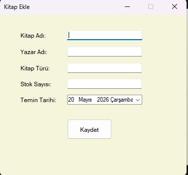
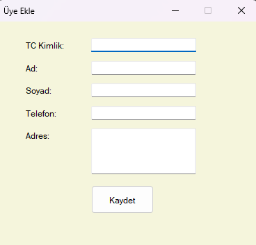
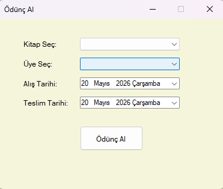
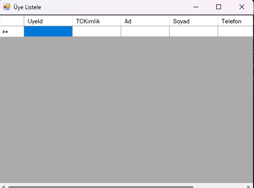
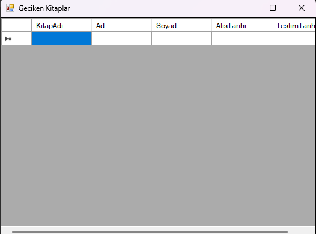

# 📚 Kütüphane Otomasyonu

Bu proje, bir kütüphanenin temel işleyişini yönetmek amacıyla geliştirilmiş bir Windows Forms uygulamasıdır.

---

# 🚀 Özellikler

- Kitap ekleme
- Üye ekleme
- Kitap ödünç alma
- Kitap listeleme
- Üye listeleme
- Geciken kitapları görüntüleme

---

# 🛠 Kullanılan Teknolojiler

- C#
- Windows Forms
- SQL Server LocalDB
- ADO.NET
- Visual Studio

---

# ⚙️ Kurulum

1. Projeyi indirin
2. Visual Studio ile açın
3. Start (Başlat) butonuna basın
4. Veritabanı otomatik oluşturulacaktır

---

# ▶ Kullanım

- Ana ekrandan ilgili işlemi seçin
- Kitap ve üye kayıtlarını oluşturun
- Ödünç alma ekranından kitap ödünç verin
- Listeleme ekranlarından tüm kayıtları görüntüleyin
- Geciken kitapları ayrı ekranda görüntüleyin

---

# 👨‍💻 Geliştirici

İbrahim Can Yurtsev

Görsel Programlama Dersi Projesi
